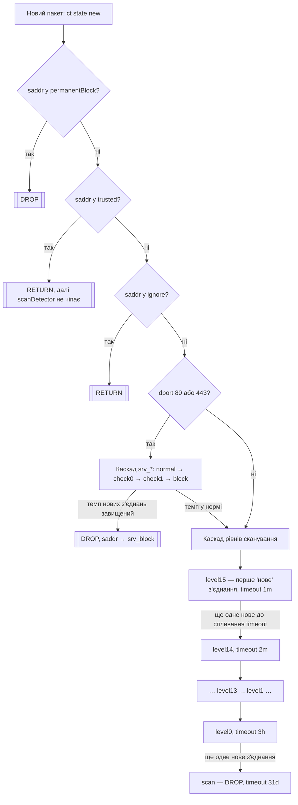

# scan-detector

nftables-детектор сканування портів із прогресивним graylisting (IPv4/IPv6),
списками довіри/ігнору/перманентного блоку та окремим захистом docker-контейнерів
через `forward`-ланцюг.

Проєкту 10+ років — почалось як один невеликий bash-скрипт з `sudo nft add ...`,
виписаними вручну. Цей репозиторій — його продуктизована версія: та сама логіка
nft-правил, але з атомарним застосуванням, генерацією каскадів циклом і
живим керуванням списками без повного перестворення таблиці.

## Компоненти

| Файл | Призначення |
|---|---|
| `nft-scan-detector` | (Пере)генерує весь ruleset таблиці `inet scanDetector` і застосовує його атомарно (`nft -c -f` → `nft -f`). Викликається один раз при старті системи. |
| `scan-detect-tool` | CLI для живого керування списками `trusted` / `ignore` / `permanentBlock` (додати, видалити, показати) — без перестворення таблиці. |

Обидва скрипти вважають файли в `/etc/nft-scandetect/*.list` єдиним джерелом
правди для цих трьох списків (докладніше — нижче).

## Вимоги

- Linux з `nftables` (утиліта `nft`, версія з підтримкою `flags dynamic,timeout` та JSON-виводу `-j`)
- `jq` — потрібен `scan-detect-tool` для розбору `nft -j`
- `sudo` — обидва скрипти викликають привілейовані команди через `sudo` (працює як з-під звичайного користувача з sudo-правами, так і з-під root)
- Docker — опційно; якщо `docker` відсутній у `PATH`, `forward`-правила для контейнерів просто не генеруються, `input` продовжує працювати як завжди

## Встановлення

```sh
sudo install -m 755 nft-scan-detector /usr/local/sbin/nft-scan-detector
sudo install -m 755 scan-detect-tool  /usr/local/sbin/scan-detect-tool

sudo install -m 644 systemd/scan-detector.service /etc/systemd/system/scan-detector.service
sudo systemctl daemon-reload
sudo systemctl enable --now scan-detector.service
```

Якщо раніше скрипт викликався "останньою надією" з `/etc/rc.local` — приберіть
цей виклик, тепер запуск відбувається через systemd-юніт (див. нижче), впорядкований
після Docker.

## Як це працює

Кожен новий (`ct state new`) пакет на вході (`input`) або на вході в docker-мережу
(`forward`, окремо для кожного bridge) проходить одну й ту саму послідовність
перевірок:



Тобто: одне нове з'єднання само по собі нічого не блокує — адреса лише потрапляє
на `level15` (найкоротший таймаут). Але якщо джерело продовжує відкривати нові
з'єднання швидше, ніж встигає спливти таймаут поточного рівня, воно щоразу
"падає" на рівень нижче (з довшим таймаутом), і врешті потрапляє в `scan` —
звідти дропається на 31 день. Якщо ж пауза між спробами достатня — рівень
просто протухає сам, без жодного блокування.

Каскад `srv_*` для портів 80/443 — окрема, коротша драбина (5s → 10s → 15s → 1m),
яка відсікає надто "нервові" повторні нові з'єднання до веб-сервісу ще до того,
як вони встигнуть докотитись до основного каскаду рівнів.

Уся ця послідовність продубльована:
- для `input` (трафік на сам хост) і для кожного docker bridge в `forward`
  (трафік ззовні до контейнерів, `iifname != IFACE oifname IFACE`);
- окремо для IPv4 (`trusted`, `ignore`, `permanentBlock`, `level0..15`, `scan`)
  і IPv6 (`trusted6`, `ignore6`, `permanentBlock6`, `level6_0..15`, `scan6`).

## Списки: trusted / ignore / permanentBlock

- **trusted** — довірені джерела (напр. NOC-сервери), пропускаються (`return`) без обмежень.
- **ignore** — адреси/мережі, які взагалі не мають сенсу перевіряти (напр. loopback, link-local, приватні docker-мережі).
- **permanentBlock** — дропаються одразу і безумовно, ще до перевірки trusted/ignore.

Керування — через `scan-detect-tool`:

```sh
scan-detect-tool --add-trusted 176.104.57.1
scan-detect-tool --add-ignore 10.3.2.0/24
scan-detect-tool --add-permanent 185.177.72.0/24
scan-detect-tool --list 185.177.72.5
scan-detect-tool --delete 185.177.72.5
scan-detect-tool --dry-run --add-trusted 192.0.2.1   # показати dry-run, нічого не змінюючи
```

Кожна команда одразу міняє живий сет через `nft` **і** відповідний
override-файл у `/etc/nft-scandetect/`:

| Список | Override-файл (IPv4) | Override-файл (IPv6) |
|---|---|---|
| trusted | `trusted-extra.list` | `trusted6-extra.list` |
| ignore | `ignore-extra.list` | `ignore6-extra.list` |
| permanentBlock | `permanent-extra.list` | `permanent6-extra.list` |

Якщо такого файлу ще нема — він бутстрапиться поточним станом живого сету
(щоб заводські дефолти з `nft-scan-detector` не загубились), а надалі саме файл
є джерелом правди: під час наступної повної перегенерації (`nft-scan-detector`)
його вміст **повністю замінює** заводські дефолти для цього списку (не merge).

## Відомі обмеження і TODO

- **Live-стан скидається при кожному запуску `nft-scan-detector`.** Скрипт
  робить `delete table` + повне перестворення, тобто `scan`/`level*`/`srv_*`
  (усе, що накопичив детектор про поточних "підозрюваних") зникає разом з
  таблицею. Це прийнятно, поки скрипт запускається один раз при старті системи,
  і свідомо залишено як є — логіка живе 10+ років і поки не готова до
  кардинальної переробки. Якщо колись знадобиться періодичний перезапуск
  (напр. для підхоплення нових docker-мереж без ребута) — знадобиться
  зберігати/відновлювати live-стан або переходити на інкрементальне
  застосування без `delete table`.
- **Немає автоматичного підхоплення нових docker-мереж без перезапуску
  сервісу.** Зараз список bridge-інтерфейсів визначається один раз при
  запуску `nft-scan-detector`. Планується systemd-timer або docker
  event-хук, який рестартує сервіс при появі/зникненні docker-мережі —
  з урахуванням обмеження вище.
- **Опціональне від'єднання від Docker.** Прапорець/env-змінна, що вимикає
  генерацію `forward`-правил і залишає лише `input` — для хостів без Docker
  або де docker-мережі захищаються інакше.

## Ліцензія

GNU GPL v2 — див. [LICENSE](LICENSE).
