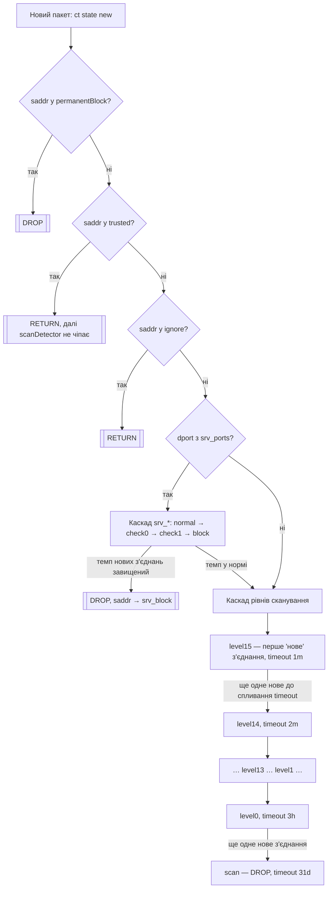

# scan-detector

nftables-детектор сканування портів із прогресивним graylisting (IPv4/IPv6),
списками довіри/ігнору/перманентного блоку та окремим захистом docker-контейнерів
через `forward`-ланцюг.

Проєкту 10+ років — почалось як один невеликий bash-скрипт з `sudo nft add ...`,
виписаними вручну. Цей репозиторій — його продуктизована версія: та сама логіка
nft-правил, але з атомарним застосуванням, генерацією каскадів циклом і
живим керуванням списками без повного перестворення таблиці.

## Історія

Ідея спершу підглянута в прикладах правил для MikroTik RouterOS — там здавна
є класичний рецепт градуйованого захисту SSH від брутфорсу через
`address-list` з кількома таймаутами (спроба → підозра → блок). Звідси й теза,
яку варто повторювати частіше: RouterOS — це, по суті, Linux у гарній
обгортці 😉.

Перша власна реалізація цієї ідеї була значно вужчою: `iptables` + `ipset`,
і лише для захисту SSH від брутфорсу — без градації на 16 рівнів, без
docker-інтеграції, без IPv6.

Поточна версія на `nftables` — саме той скрипт, з якого зроблено цей
репозиторій — написана приблизно 10 років тому, тобто невдовзі після того,
як у `nftables` взагалі з'явились dynamic-сети з `timeout` (~2014–2015). Вона
експлуатувалась приватно й розвивалась усі ці роки, але як окремий публічний
проєкт до цього моменту не оформлювалась.

## Компоненти

| Файл | Призначення |
|---|---|
| `src/bash/nft-scan-detector` | (Пере)генерує весь ruleset таблиці `inet scanDetector` і застосовує його атомарно (`nft -c -f` → `nft -f`). Викликається один раз при старті системи. |
| `src/bash/scan-detect-tool` | CLI для живого керування списками `trusted` / `ignore` / `permanentBlock` (додати, видалити, показати) — без перестворення таблиці. |
| `src/bash/docker-network-watch` | Слухає `docker events` і рестартує `scan-detector.service` при появі/зникненні docker-мережі. Опційний компонент — див. розділ нижче. |

Обидва скрипти вважають файли в `/etc/nft-scandetect/*.list` єдиним джерелом
правди для цих трьох списків (докладніше — нижче).

## Вимоги

- Linux з `nftables` (утиліта `nft`, версія з підтримкою `flags dynamic,timeout` та JSON-виводу `-j`)
- `jq` — потрібен `scan-detect-tool` для розбору `nft -j`
- `sudo` — обидва скрипти викликають привілейовані команди через `sudo` (працює як з-під звичайного користувача з sudo-правами, так і з-під root)
- Docker — опційно; якщо `docker` відсутній у `PATH`, `nft-scan-detector` сам вмикає режим `--no-docker`: ланцюг `forward` узагалі не створюється, `input` продовжує працювати як завжди
- IPv6 — опційно; керується `/etc/nft-scandetect/ipv6` (`0`/`1`/`auto`, дефолт `auto`) і прапорцем `--no-ipv6` — див. розділ нижче
- `ip` (пакет `iproute2`) — опційно; потрібен лише для точнішого автовизначення живого IPv6 (перевірка реальної адреси, не тільки sysctl). Без нього автовизначення спирається лише на `net.ipv6.conf.*.disable_ipv6`

## Встановлення

```sh
sudo install -m 755 src/bash/nft-scan-detector /usr/local/sbin/nft-scan-detector
sudo install -m 755 src/bash/scan-detect-tool  /usr/local/sbin/scan-detect-tool

sudo install -m 644 systemd/scan-detector.service /etc/systemd/system/scan-detector.service
sudo systemctl daemon-reload
sudo systemctl enable --now scan-detector.service
```

Якщо раніше скрипт викликався "останньою надією" з `/etc/rc.local` — приберіть
цей виклик, тепер запуск відбувається через systemd-юніт (див. нижче), впорядкований
після Docker.

## Оновлення

```sh
git pull
sudo install -m 755 src/bash/nft-scan-detector /usr/local/sbin/nft-scan-detector
sudo install -m 755 src/bash/scan-detect-tool  /usr/local/sbin/scan-detect-tool
sudo systemctl restart scan-detector.service
```

**Важливо: останній рядок — `restart`, не `enable --now` і не `daemon-reload`.**
Якщо `scan-detector.service` вже enabled і активний (типовий випадок після
першого встановлення), `systemctl enable --now` на вже активному юніті —
no-op: `start` на unit, який вже `active`, нічого не робить, ExecStart
повторно не виконується. `daemon-reload` теж не рестартовує сам процес —
він тільки перечитує визначення юніта. Тобто нову версію скрипта на диску
жоден з цих двох викликів не підхопить — потрібен саме явний `restart`.
(`enable --now` лишається правильною командою тільки для першого
встановлення, коли юніта ще нема.)

## Взаємодія з `nftables.service`

Якщо на хості окремо є системний `nftables.service` (типово на Debian/Ubuntu,
керує `/etc/nftables.conf`) — його старт/рестарт зазвичай виконує `flush
ruleset` і накочує лише той файл, стираючи **весь** живий ruleset, включно з
`inet scanDetector`. Це не залежить від override-файлів чи стану
`scan-detector.service` — воно просто зникає з ядра при будь-якому
`systemctl restart nftables.service`, і застосується знову лише після
наступного `systemctl restart scan-detector.service`.

Це пом'якшено двома речами:
- `scan-detector.service` тепер впорядкований `After=nftables.service` —
  на старті системи наша таблиця гарантовано застосовується вже після
  того, як `nftables.conf` накотився, а не в гонці з ним;
- опційний drop-in `systemd/nftables.service.d/restart-scan-detector.conf`
  — автоматично рестартує `scan-detector.service` одразу після кожного
  старту/рестарту `nftables.service` (`ExecStartPost=`), у тому числі
  ручного. Live-стан каскаду це переживає, тож рестарт нічого не коштує.
  Встановлюється окремо, лише якщо `nftables.service` реально є на хості:

```sh
sudo install -D -m 644 systemd/nftables.service.d/restart-scan-detector.conf \
    /etc/systemd/system/nftables.service.d/restart-scan-detector.conf
sudo systemctl daemon-reload
```

## Як це працює

Кожен новий (`ct state new`) пакет на вході (`input`) або на вході в docker-мережу
(`forward`, окремо для кожного bridge) проходить одну й ту саму послідовність
перевірок:



Тобто: одне нове з'єднання само по собі нічого не блокує — адреса лише потрапляє
на `level15` (найкоротший таймаут). Але якщо джерело продовжує відкривати нові
з'єднання швидше, ніж встигає спливти таймаут поточного рівня, воно щоразу
"падає" на рівень нижче (з довшим таймаутом), і врешті потрапляє в `scan` —
звідти дропається на 31 день. Якщо ж пауза між спробами достатня — рівень
просто протухає сам, без жодного блокування.

Каскад `srv_*` для захищених портів (за замовчуванням tcp/80, tcp/443 —
перелік і таймаути стадій конфігуруються, див. нижче) — окрема, коротша
драбина (5s → 10s → 15s → 1m за замовчуванням), яка відсікає надто "нервові"
повторні нові з'єднання до сервісу ще до того, як вони встигнуть докотитись
до основного каскаду рівнів.

Уся ця послідовність продубльована:
- для `input` (трафік на сам хост) і для кожного docker bridge в `forward`
  (трафік ззовні до контейнерів, `iifname != IFACE oifname IFACE`);
- окремо для IPv4 (`trusted`, `ignore`, `permanentBlock`, `level0..N`, `scan`)
  і IPv6 (`trusted6`, `ignore6`, `permanentBlock6`, `level6_0..N`, `scan6`) —
  `N` за замовчуванням 15 (16 рівнів), теж конфігурується.

## Прапорці `nft-scan-detector`

Сім прапорців, двох різних видів:

- **Модифікатори звичайної генерації** — `--reset-live-state`, `--no-docker`
  і `--no-ipv6`. Незалежні один від одного й вільно комбінуються в
  будь-якому порядку — кожен впливає на свою частину ruleset і не
  залежить від інших.
- **Окремі режими** — `--stop-fwd`, `--stop-fwd-docker`, `--stop`, `--init`.
  Кожен нічого не генерує, робить рівно одну дію і виходить; взаємовиключні
  і між собою, і з трьома модифікаторами вище (бо генерації, яку можна
  було б модифікувати, в цих режимах просто нема).

### `--reset-live-state`

`nft-scan-detector` завжди перестворює таблицю (`delete table` + `add table`)
— так було і в оригінальному скрипті 10 років тому. Але тепер це більше не
означає втрату прогресу: перед перестворенням береться знімок поточних
елементів усіх dynamic-сетів (`scan`, `level0..level15`, `srv_normal/check0/check1/block`
і їхніх IPv6-відповідників) разом із рештою таймауту, і одразу після
перестворення сетів цей знімок відновлюється — в тій самій nft-транзакції
(`nft -c -f` перевіряє й дамп, і відновлення разом з рештою ruleset).
Знімок також зберігається в `/var/lib/nft-scandetect/live-state-<ts>.tsv` —
поруч з аудитом самого ruleset.

Якщо потрібна стара поведінка (наприклад, свідомо "амністувати" всіх, хто
зараз у каскаді) — прапорець вимикає збереження, і таблиця перестворюється
з чистими сетами:

```sh
sudo nft-scan-detector --reset-live-state
```

Списки `trusted`/`ignore`/`permanentBlock` цього не стосуються — вони й так
не втрачаються, бо йдуть через override-файли (нижче), а не через live-стан
dynamic-сетів.

### `--no-docker`

Вимикає генерацію ланцюга `forward` і всіх per-bridge правил — лишається
тільки `input`. Для хостів без Docker або де docker-мережі захищаються
інакше. Вмикається і вручну, і автоматично — якщо на хості немає бінарника
`docker`, `nft-scan-detector` сам про це попереджає в stderr і працює так,
ніби прапорець передали:

```sh
sudo nft-scan-detector --no-docker
```

Сети `level*`/`scan`/`srv_*` спільні для `input` і `forward` (це той самий
IP-рівень graylisting), тож `--no-docker` ніяк не заважає `--reset-live-state`
і навпаки — наприклад, `--reset-live-state --no-docker` разом скидає live-стан
і водночас не створює `forward`.

### `--no-ipv6` та `/etc/nft-scandetect/ipv6`

Не генерує жодних v6-сетів і v6-правил: `trusted6`, `ignore6`,
`permanentBlock6`, `level6_*`, `srv6_*`, `scan6`, і всі `ip6`-рядки в
`input` і в кожному `forward`. Для хостів, де IPv6 фактично не працює —
нема сенсу тримати мертві сети й правила, які ніколи ні на що не
спрацюють.

Два способи керування, у порядку пріоритету:

1. **`--no-ipv6`** (прапорець) — разовий force-off для цього запуску,
   переважає все нижче:

   ```sh
   sudo nft-scan-detector --no-ipv6
   ```

2. **`/etc/nft-scandetect/ipv6`** — постійне налаштування, якщо прапорця
   не було. Рівно одне слово, дефолт `auto`:

   | Значення | Дія |
   |---|---|
   | `0` / `off` | завжди вимкнено (як `--no-ipv6`, але постійно, без прапорця) |
   | `1` / `on` | завжди увімкнено, незалежно від sysctl чи наявних адрес |
   | `auto` | автовизначення (нижче) |

`auto` вмикає v6-ruleset, лише якщо **обидві** умови виконані: IPv6 не
вимкнено системно (`net.ipv6.conf.all.disable_ipv6=0`, чи взагалі відсутній
`/proc/sys/net/ipv6` — тоді вимкнено) **і** десь на хості реально є
маршрутизована (не link-local) IPv6-адреса — `ip -6 -o addr show scope
global`, перевіряється на **всіх** інтерфейсах, включно з `lo` (там теж
трапляються "білі" адреси). Сам `disable_ipv6=0` — занадто слабкий сигнал:
це стан практично будь-якого інтерфейса за замовчуванням, включно з
щойно створеним docker-бриджем, а не доказ реальної IPv6-звʼязності.
Якщо `ip` немає в системі — перевірити адреси нічим, довіряємось лише
sysctl (як було раніше).

Незалежно від глобального рішення, **для кожного docker bridge окремо**
`forward`-правила для `ip6` пропускаються, якщо саме на цьому bridge
IPv6 вимкнено (`net.ipv6.conf.<bridge>.disable_ipv6=1`) — навіть коли
глобально IPv6 живий. Це **навмисно простіша** перевірка, ніж глобальна
(лише sysctl, без вимоги реальної адреси на самому bridge) — топологій
транзиту трафіку до контейнерів забагато, щоб бути тут категоричними;
хибний "вимкнено" був би дірою в захисті, а хибний "увімкнено" — просто
зайвим (нешкідливим) правилом. Якщо потрібна точніша поведінка для
конкретного bridge — `net.ipv6.conf.<bridge>.disable_ipv6` виставляється
вручну, скрипт це вже враховує. `input` — виняток: це не per-interface
ланцюг, тож там рішення лише глобальне.

### `--stop-fwd` / `--stop-fwd-docker`

Окремий режим — нічого не перегенеровує, лише знімає ланцюг `forward` із
**живої** таблиці (`input`, усі сети й live-стан не чіпає). Взаємовиключний
з `--reset-live-state`/`--no-docker` (це прапорці генерації, а окремі режими
її взагалі не запускають).

Навіщо: `forward` із великою кількістю per-bridge правил (16 рівнів × dual
stack × кожен bridge) заважає Docker чисто "гаситись" — daemon під час
зупинки посилає купу netlink-подій на видалення бриджів/veth, і активний
hook на `forward` це лише сповільнює. `--stop-fwd` знімає цей hook заздалегідь:

```sh
sudo nft-scan-detector --stop-fwd            # тільки зняти forward
sudo nft-scan-detector --stop-fwd-docker     # зняти forward + systemctl stop docker.socket docker.service
```

`--stop-fwd-docker` зупиняє спершу `docker.socket`, потім `docker.service`
(у цьому порядку — інакше socket-activation підніме `docker.service` назад
щойно хтось звернеться до сокета). Щоб повернути `forward` — достатньо
звичайного запуску `nft-scan-detector` (без окремих режимів) після того, як
Docker знову працює.

### `--stop`

Ще один окремий режим — прибирає `inet scanDetector` із системи **повністю**
(`delete table`): і `input`, і `forward`, і всі сети разом з live-станом.
На відміну від `--stop-fwd`, після цього хост і docker-мережі не захищені
scanDetector-ом жодним чином, а не лише в частині `forward`:

```sh
sudo nft-scan-detector --stop
```

Щоб повернути — звичайний запуск `nft-scan-detector` (перестворює таблицю з
нуля; live-стан за час "простою", природно, вже нізвідки відновлювати).

### `--init`

Ще один окремий режим — лише досіює відсутні override-файли в
`/etc/nft-scandetect/` вбудованими дефолтами і виходить, не чіпаючи живу
таблицю, Docker чи live-стан. Корисно, щоб проінспектувати чи заздалегідь
поправити конфіги **до** першого реального застосування таблиці:

```sh
sudo nft-scan-detector --init
# або те саме через scan-detect-tool:
sudo scan-detect-tool --init
```

Взаємовиключний з рештою прапорців. Безпечно викликати й повторно, і після
того, як таблиця вже застосована — існуючі файли не чіпає, довписує лише
те, чого справді бракує.

## Пріоритет hook'ів `input`/`forward`

Дефолт — `-50` (як в оригінальному скрипті 10 років тому). Перевизначається
файлом `/etc/nft-scandetect/priority` — **рівно одне ціле число, без
коментарів** (на відміну від `*-extra.list` файлів вище, читається просто
через `head -1`, без парсингу коментарів/порожніх рядків). Створюється сам
при першому запуску `nft-scan-detector` з дефолтним значенням.

Нелегітимне значення (не ціле число) чи зіпсований файл не ламають ruleset —
`nft-scan-detector` виводить попередження в stderr і використовує дефолт `-50`.

Керувати можна вручну (`echo -75 | sudo tee /etc/nft-scandetect/priority`) або
через `scan-detect-tool`:

```sh
scan-detect-tool --set-priority -75
```

На відміну від `--add-trusted`/`--add-ignore`/`--add-permanent`, це не
"живий" `add element` — пріоритет належить самому hook'у, тож застосувати
нове значення можна лише повною перегенерацією. `--set-priority` записує
файл і одразу рестартує `scan-detector.service` (якщо юніт не знайдено —
попереджає й пропонує застосувати вручну через `nft-scan-detector`). Live-стан
каскаду цей рестарт переживає так само, як і будь-який інший.

## Драбина ескалації та захищені сервіс-порти

Так само, як `priority`, ще три параметри винесені в override-файли (замість
хардкоду в скрипті) — і так само: невалідний файл ніколи не ламає ruleset,
а фолбечить на вбудований дефолт із попередженням у stderr.

### `/etc/nft-scandetect/level_timeouts` — кількість рівнів, їхні таймаути й таймаут `scan`

За замовчуванням — 16 рядків, `0:3h` .. `15:1m` (те, що й завжди було).
Формат: `N:timeout` по рядку, коментарі через `#`. Рядки мають утворювати
**суцільну послідовність від 0** — без пропусків і без дублікатів (бо каскад
`level0 → level1 → … → levelN → scan` будується саме по цій послідовності).
Кількість рядків у файлі = кількість рівнів: хочеш 20 рівнів замість 16 —
допиши `16:1m`, `17:1m`, `18:1m`, `19:1m`; хочеш 10 — прибери зайві рядки.
Той самий список таймаутів іде і на IPv4 (`level0..levelN`), і на IPv6
(`level6_0..level6_N`) — як і зараз.

Той самий файл — місце й для таймауту фінального блоку `scan`/`scan6` (куди
адреса потрапляє, "провалившись" крізь `level0`, і звідки дропається до
кінця цього таймауту): необов'язковий рядок `scan:timeout`, за замовчуванням
`scan:31d` (те, що й завжди було, просто раніше було вшите числом у код).
Якщо рядка нема — 31 день і без нього. Два `scan:` рядки одразу, чи
`scan:` не там, де очікується формат — уся конфігурація файлу (і рівні
теж) фолбечить на вбудований дефолт із попередженням.

### `/etc/nft-scandetect/srv_ports` — які порти захищає каскад `srv_*`

За замовчуванням — `tcp/80`, `tcp/443` (те, що й завжди було, просто раніше
було вшите як `tcp dport { 80, 443 }`). Формат: `proto/port` по рядку,
`proto` — `tcp` або `udp`. Можна додати, наприклад, `udp/53`:

```
tcp/80
tcp/443
udp/53
```

Порти одного протоколу групуються в один `dport`-матч; кожен протокол
отримує свій рядок правил, але **всі протоколи пишуть у ті самі спільні
сети `srv_normal`/`srv_check0`/`srv_check1`/`srv_block`** — це throttle по
джерельній адресі ("як часто ця IP відкриває нові з'єднання до захищених
портів"), а не окремий трекінг per-протокол. Невідомий рядок (не
`tcp|udp/1..65535`) пропускається з попередженням, решта застосовується.

### `/etc/nft-scandetect/srv_timeouts` — таймаути 4 стадій `srv_*`

За замовчуванням — `normal:5s`, `check0:10s`, `check1:15s`, `block:1m` (те,
що й завжди було). Формат: `stage:timeout` по рядку, рівно ці чотири стадії,
кожна один раз (порядок рядків не важливий). Неповний набір чи зайва/невідома
стадія — фолбек на дефолт цілком (не частково).

## Автопідхоплення docker-мереж: `docker-network-watch`

`nft-scan-detector` визначає список docker-бриджів один раз при запуску.
Якщо ти рідко, але додаєш/прибираєш docker-мережі "на живу" — щоб новий
bridge підхопився в `forward` без ручного рестарту сервісу, є окремий
слухач подій Docker: `src/bash/docker-network-watch` +
`systemd/docker-network-watch.service`.

Як це працює: скрипт підписується на `docker events --filter type=network`
(create/destroy), і на кожну таку подію викликає
`systemctl restart scan-detector.service`. Live-стан каскаду переживає цей
рестарт (див. `--reset-live-state` вище), тож рестарт нічого не коштує.
Якщо кілька мереж з'являються одна за одною (напр. `docker compose up`
одразу створює декілька) — вбудований дебаунс (2s тиші після останньої
події) згортає серію в один рестарт, а не по одному на кожну мережу.

Встановлення:

```sh
sudo install -m 755 src/bash/docker-network-watch /usr/local/sbin/docker-network-watch
sudo install -m 644 systemd/docker-network-watch.service /etc/systemd/system/docker-network-watch.service
sudo systemctl daemon-reload
sudo systemctl enable --now docker-network-watch.service
```

Юніт має `Requires=docker.service` — якщо Docker на хості явно зупинити
(зокрема через `nft-scan-detector --stop-fwd-docker`), слухач зупиниться
разом з ним, а не крутитиметься марно в `Restart=always`. Якщо на хості
взагалі немає Docker — цей юніт не потрібен, не enable-ти його.

## Списки: trusted / ignore / permanentBlock

- **trusted** — довірені джерела (напр. NOC-сервери), пропускаються (`return`) без обмежень.
- **ignore** — адреси/мережі, які взагалі не мають сенсу перевіряти (напр. loopback, link-local, приватні docker-мережі).
- **permanentBlock** — дропаються одразу і безумовно, ще до перевірки trusted/ignore.

Керування — через `scan-detect-tool`:

```sh
scan-detect-tool --add-trusted 176.104.57.1
scan-detect-tool --add-ignore 10.3.2.0/24
scan-detect-tool --add-permanent 185.177.72.0/24
scan-detect-tool --list 185.177.72.5
scan-detect-tool --delete 185.177.72.5
scan-detect-tool --dry-run --add-trusted 192.0.2.1   # показати dry-run, нічого не змінюючи
```

Кожна команда одразу міняє живий сет через `nft` **і** відповідний
override-файл у `/etc/nft-scandetect/`:

| Список | Override-файл (IPv4) | Override-файл (IPv6) |
|---|---|---|
| trusted | `trusted-extra.list` | `trusted6-extra.list` |
| ignore | `ignore-extra.list` | `ignore6-extra.list` |
| permanentBlock | `permanent-extra.list` | `permanent6-extra.list` |

Якщо такого файлу ще нема — він бутстрапиться поточним станом живого сету
(щоб заводські дефолти з `nft-scan-detector` не загубились), а надалі саме файл
є джерелом правди: під час наступної повної перегенерації (`nft-scan-detector`)
його вміст **повністю замінює** заводські дефолти для цього списку (не merge).

## Відомі обмеження і TODO

Наразі суттєвих відкритих обмежень нема — автопідхоплення docker-мереж
закрито `docker-network-watch` (вище), зупинка перед вимкненням Docker —
`--stop-fwd`/`--stop-fwd-docker`, live-стан переживає будь-який із цих
рестартів.

## Ліцензія

GNU GPL v2 — див. [LICENSE](LICENSE).
