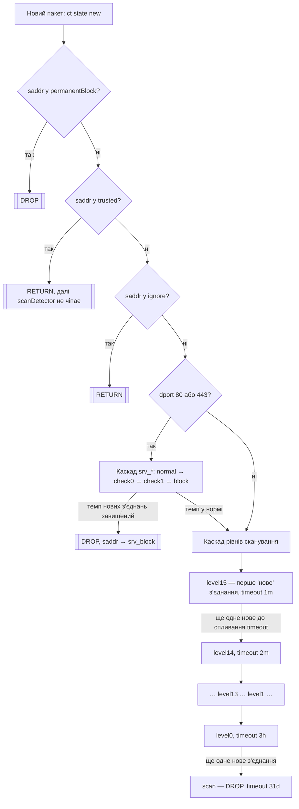

# scan-detector

nftables-детектор сканування портів із прогресивним graylisting (IPv4/IPv6),
списками довіри/ігнору/перманентного блоку та окремим захистом docker-контейнерів
через `forward`-ланцюг.

Проєкту 10+ років — почалось як один невеликий bash-скрипт з `sudo nft add ...`,
виписаними вручну. Цей репозиторій — його продуктизована версія: та сама логіка
nft-правил, але з атомарним застосуванням, генерацією каскадів циклом і
живим керуванням списками без повного перестворення таблиці.

## Історія

Ідея спершу підглянута в прикладах правил для MikroTik RouterOS — там здавна
є класичний рецепт градуйованого захисту SSH від брутфорсу через
`address-list` з кількома таймаутами (спроба → підозра → блок). Звідси й теза,
яку варто повторювати частіше: RouterOS — це, по суті, Linux у гарній
обгортці 😉.

Перша власна реалізація цієї ідеї була значно вужчою: `iptables` + `ipset`,
і лише для захисту SSH від брутфорсу — без градації на 16 рівнів, без
docker-інтеграції, без IPv6.

Поточна версія на `nftables` — саме той скрипт, з якого зроблено цей
репозиторій — написана приблизно 10 років тому, тобто невдовзі після того,
як у `nftables` взагалі з'явились dynamic-сети з `timeout` (~2014–2015). Вона
експлуатувалась приватно й розвивалась усі ці роки, але як окремий публічний
проєкт до цього моменту не оформлювалась.

## Компоненти

| Файл | Призначення |
|---|---|
| `src/bash/nft-scan-detector` | (Пере)генерує весь ruleset таблиці `inet scanDetector` і застосовує його атомарно (`nft -c -f` → `nft -f`). Викликається один раз при старті системи. |
| `src/bash/scan-detect-tool` | CLI для живого керування списками `trusted` / `ignore` / `permanentBlock` (додати, видалити, показати) — без перестворення таблиці. |
| `src/bash/docker-network-watch` | Слухає `docker events` і рестартує `scan-detector.service` при появі/зникненні docker-мережі. Опційний компонент — див. розділ нижче. |

Обидва скрипти вважають файли в `/etc/nft-scandetect/*.list` єдиним джерелом
правди для цих трьох списків (докладніше — нижче).

## Вимоги

- Linux з `nftables` (утиліта `nft`, версія з підтримкою `flags dynamic,timeout` та JSON-виводу `-j`)
- `jq` — потрібен `scan-detect-tool` для розбору `nft -j`
- `sudo` — обидва скрипти викликають привілейовані команди через `sudo` (працює як з-під звичайного користувача з sudo-правами, так і з-під root)
- Docker — опційно; якщо `docker` відсутній у `PATH`, `nft-scan-detector` сам вмикає режим `--no-docker`: ланцюг `forward` узагалі не створюється, `input` продовжує працювати як завжди

## Встановлення

```sh
sudo install -m 755 src/bash/nft-scan-detector /usr/local/sbin/nft-scan-detector
sudo install -m 755 src/bash/scan-detect-tool  /usr/local/sbin/scan-detect-tool

sudo install -m 644 systemd/scan-detector.service /etc/systemd/system/scan-detector.service
sudo systemctl daemon-reload
sudo systemctl enable --now scan-detector.service
```

Якщо раніше скрипт викликався "останньою надією" з `/etc/rc.local` — приберіть
цей виклик, тепер запуск відбувається через systemd-юніт (див. нижче), впорядкований
після Docker.

## Як це працює

Кожен новий (`ct state new`) пакет на вході (`input`) або на вході в docker-мережу
(`forward`, окремо для кожного bridge) проходить одну й ту саму послідовність
перевірок:



Тобто: одне нове з'єднання само по собі нічого не блокує — адреса лише потрапляє
на `level15` (найкоротший таймаут). Але якщо джерело продовжує відкривати нові
з'єднання швидше, ніж встигає спливти таймаут поточного рівня, воно щоразу
"падає" на рівень нижче (з довшим таймаутом), і врешті потрапляє в `scan` —
звідти дропається на 31 день. Якщо ж пауза між спробами достатня — рівень
просто протухає сам, без жодного блокування.

Каскад `srv_*` для портів 80/443 — окрема, коротша драбина (5s → 10s → 15s → 1m),
яка відсікає надто "нервові" повторні нові з'єднання до веб-сервісу ще до того,
як вони встигнуть докотитись до основного каскаду рівнів.

Уся ця послідовність продубльована:
- для `input` (трафік на сам хост) і для кожного docker bridge в `forward`
  (трафік ззовні до контейнерів, `iifname != IFACE oifname IFACE`);
- окремо для IPv4 (`trusted`, `ignore`, `permanentBlock`, `level0..15`, `scan`)
  і IPv6 (`trusted6`, `ignore6`, `permanentBlock6`, `level6_0..15`, `scan6`).

## Прапорці `nft-scan-detector`

Обидва прапорці незалежні один від одного й вільно комбінуються в будь-якому
порядку — кожен впливає на свою частину ruleset і не залежить від іншого.

### `--reset-live-state`

`nft-scan-detector` завжди перестворює таблицю (`delete table` + `add table`)
— так було і в оригінальному скрипті 10 років тому. Але тепер це більше не
означає втрату прогресу: перед перестворенням береться знімок поточних
елементів усіх dynamic-сетів (`scan`, `level0..level15`, `srv_normal/check0/check1/block`
і їхніх IPv6-відповідників) разом із рештою таймауту, і одразу після
перестворення сетів цей знімок відновлюється — в тій самій nft-транзакції
(`nft -c -f` перевіряє й дамп, і відновлення разом з рештою ruleset).
Знімок також зберігається в `/var/lib/nft-scandetect/live-state-<ts>.tsv` —
поруч з аудитом самого ruleset.

Якщо потрібна стара поведінка (наприклад, свідомо "амністувати" всіх, хто
зараз у каскаді) — прапорець вимикає збереження, і таблиця перестворюється
з чистими сетами:

```sh
sudo nft-scan-detector --reset-live-state
```

Списки `trusted`/`ignore`/`permanentBlock` цього не стосуються — вони й так
не втрачаються, бо йдуть через override-файли (нижче), а не через live-стан
dynamic-сетів.

### `--no-docker`

Вимикає генерацію ланцюга `forward` і всіх per-bridge правил — лишається
тільки `input`. Для хостів без Docker або де docker-мережі захищаються
інакше. Вмикається і вручну, і автоматично — якщо на хості немає бінарника
`docker`, `nft-scan-detector` сам про це попереджає в stderr і працює так,
ніби прапорець передали:

```sh
sudo nft-scan-detector --no-docker
```

Сети `level*`/`scan`/`srv_*` спільні для `input` і `forward` (це той самий
IP-рівень graylisting), тож `--no-docker` ніяк не заважає `--reset-live-state`
і навпаки — наприклад, `--reset-live-state --no-docker` разом скидає live-стан
і водночас не створює `forward`.

### `--stop` / `--stop-docker`

Окремий режим — нічого не перегенеровує, лише знімає ланцюг `forward` із
**живої** таблиці (`input`, усі сети й live-стан не чіпає). Взаємовиключний
з `--reset-live-state`/`--no-docker` (це прапорці генерації, а `--stop*` її
взагалі не запускає).

Навіщо: `forward` із великою кількістю per-bridge правил (16 рівнів × dual
stack × кожен bridge) заважає Docker чисто "гаситись" — daemon під час
зупинки посилає купу netlink-подій на видалення бриджів/veth, і активний
hook на `forward` це лише сповільнює. `--stop` знімає цей hook заздалегідь:

```sh
sudo nft-scan-detector --stop            # тільки зняти forward
sudo nft-scan-detector --stop-docker     # зняти forward + systemctl stop docker.socket docker.service
```

`--stop-docker` зупиняє спершу `docker.socket`, потім `docker.service` (у
цьому порядку — інакше socket-activation підніме `docker.service` назад
щойно хтось звернеться до сокета). Щоб повернути `forward` — достатньо
звичайного запуску `nft-scan-detector` (без `--stop*`) після того, як Docker
знову працює.

## Автопідхоплення docker-мереж: `docker-network-watch`

`nft-scan-detector` визначає список docker-бриджів один раз при запуску.
Якщо ти рідко, але додаєш/прибираєш docker-мережі "на живу" — щоб новий
bridge підхопився в `forward` без ручного рестарту сервісу, є окремий
слухач подій Docker: `src/bash/docker-network-watch` +
`systemd/docker-network-watch.service`.

Як це працює: скрипт підписується на `docker events --filter type=network`
(create/destroy), і на кожну таку подію викликає
`systemctl restart scan-detector.service`. Live-стан каскаду переживає цей
рестарт (див. `--reset-live-state` вище), тож рестарт нічого не коштує.
Якщо кілька мереж з'являються одна за одною (напр. `docker compose up`
одразу створює декілька) — вбудований дебаунс (2s тиші після останньої
події) згортає серію в один рестарт, а не по одному на кожну мережу.

Встановлення:

```sh
sudo install -m 755 src/bash/docker-network-watch /usr/local/sbin/docker-network-watch
sudo install -m 644 systemd/docker-network-watch.service /etc/systemd/system/docker-network-watch.service
sudo systemctl daemon-reload
sudo systemctl enable --now docker-network-watch.service
```

Юніт має `Requires=docker.service` — якщо Docker на хості явно зупинити
(зокрема через `nft-scan-detector --stop-docker`), слухач зупиниться разом
з ним, а не крутитиметься марно в `Restart=always`. Якщо на хості взагалі
немає Docker — цей юніт не потрібен, не enable-ти його.

## Списки: trusted / ignore / permanentBlock

- **trusted** — довірені джерела (напр. NOC-сервери), пропускаються (`return`) без обмежень.
- **ignore** — адреси/мережі, які взагалі не мають сенсу перевіряти (напр. loopback, link-local, приватні docker-мережі).
- **permanentBlock** — дропаються одразу і безумовно, ще до перевірки trusted/ignore.

Керування — через `scan-detect-tool`:

```sh
scan-detect-tool --add-trusted 176.104.57.1
scan-detect-tool --add-ignore 10.3.2.0/24
scan-detect-tool --add-permanent 185.177.72.0/24
scan-detect-tool --list 185.177.72.5
scan-detect-tool --delete 185.177.72.5
scan-detect-tool --dry-run --add-trusted 192.0.2.1   # показати dry-run, нічого не змінюючи
```

Кожна команда одразу міняє живий сет через `nft` **і** відповідний
override-файл у `/etc/nft-scandetect/`:

| Список | Override-файл (IPv4) | Override-файл (IPv6) |
|---|---|---|
| trusted | `trusted-extra.list` | `trusted6-extra.list` |
| ignore | `ignore-extra.list` | `ignore6-extra.list` |
| permanentBlock | `permanent-extra.list` | `permanent6-extra.list` |

Якщо такого файлу ще нема — він бутстрапиться поточним станом живого сету
(щоб заводські дефолти з `nft-scan-detector` не загубились), а надалі саме файл
є джерелом правди: під час наступної повної перегенерації (`nft-scan-detector`)
його вміст **повністю замінює** заводські дефолти для цього списку (не merge).

## Відомі обмеження і TODO

Наразі суттєвих відкритих обмежень нема — автопідхоплення docker-мереж
закрито `docker-network-watch` (вище), зупинка перед вимкненням Docker —
`--stop`/`--stop-docker`, live-стан переживає будь-який із цих рестартів.

## Ліцензія

GNU GPL v2 — див. [LICENSE](LICENSE).
